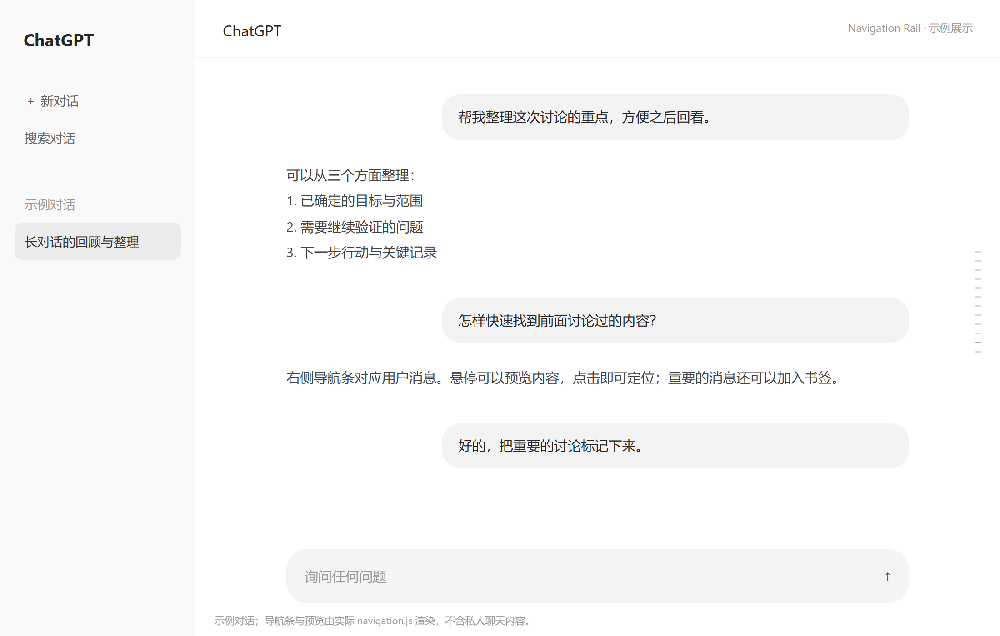
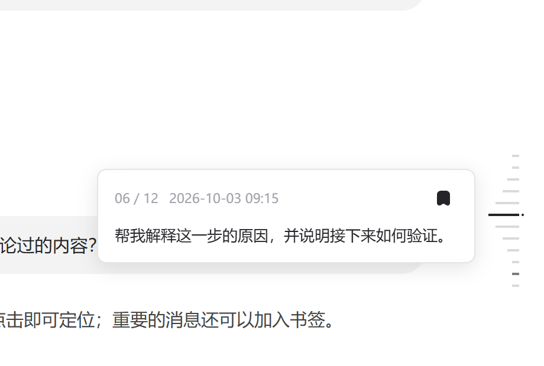
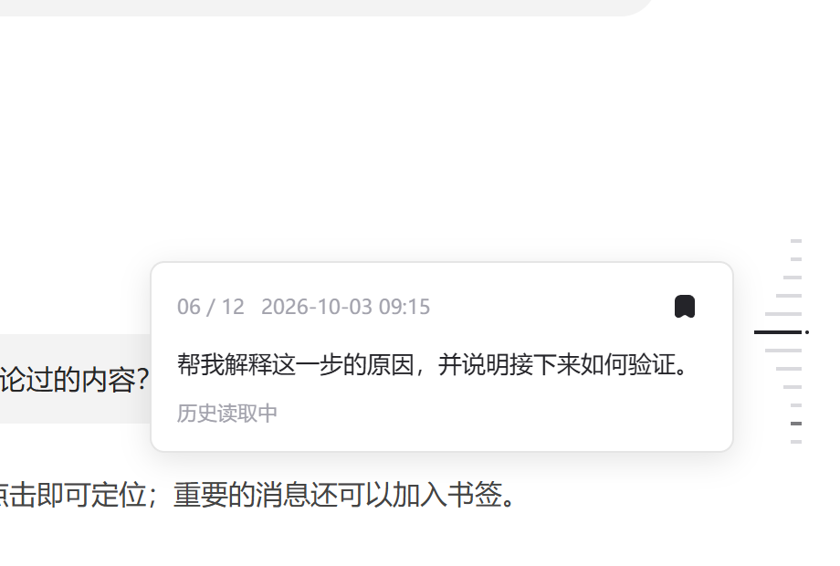

# ChatGPT Chat Navigation Rail

在 Windows 版 ChatGPT 的 **Chat 对话右侧**显示用户消息导航条：悬停预览、点击跳转、添加书签，让长对话更容易回看。

这是使用 **GPT-6.1 Sol** 模型，通过 **vibe coding** 开发的独立辅助工具，非 OpenAI 官方插件，与 OpenAI 无隶属关系。当前版本：**v1.0.0**。

## 效果展示

以下图片使用示例对话，导航条、预览和书签由实际代码渲染；周围聊天界面为展示用示意布局，不是官方应用截图，不包含私人聊天记录。

**对话右侧导航条**：每条横线对应一条用户消息。



**悬停预览与书签**：显示消息内容和发送时间，收藏后横条加深并显示小点。



**历史读取状态**：读取尚未完成时，预览框显示“历史读取中”。



## 功能

- 每个 Chat 对话显示各自的用户消息导航，Work 和 Codex 对话隐藏本工具导航。
- 悬停预览消息与发送日期时间；时间不可用时不显示。
- 读取当前分支的完整历史，包括尚未渲染的消息；读取期间显示“历史读取中”。
- 点击横条定位消息；在预览中添加书签，横条加深并显示小点。
- 保留官方启动入口，仅支持手动打开导航工具；ChatGPT 未运行时由工具启动官方应用。
- 工具仅显示托盘图标，无任务栏主窗口，不替换 ChatGPT 的图标或分组。

## 环境要求

Windows 10 / 11，64 位；安装支持 Chat / Work / Codex 的官方 ChatGPT 桌面应用。当前实现识别应用包 `OpenAI.Codex_2p2nqsd0c76g0!App`，其他桌面版本和安装渠道可能不兼容。

使用系统自带的 .NET Framework 和 Windows PowerShell，正常安装不需要管理员权限。组织策略可能限制脚本执行。

## 下载与安装

1. 下载 [v1.0.0 Windows 安装包](https://github.com/sunclxxx/ChatGPT-Chat-Navigation-Rail/releases/download/v1.0.0/ChatGPT-Chat-Navigation-Rail-Standalone-Windows.zip)，或使用 [仓库中的备用下载](https://github.com/sunclxxx/ChatGPT-Chat-Navigation-Rail/raw/refs/heads/main/downloads/ChatGPT-Chat-Navigation-Rail-Standalone-Windows.zip)。
2. 解压到普通文件夹，**不要直接在压缩包内运行**。
3. 双击 `Install.exe`，等待“安装成功”。
4. 从开始菜单打开 **Chat Navigation Rail**。

安装只创建 **Chat Navigation Rail** 开始菜单快捷方式，不创建桌面快捷方式或额外的 ChatGPT 入口。工具复制到当前用户的本地应用数据目录；安装成功后可删除解压目录。

工具只支持手动启动，不注册开机任务，也不监听普通 ChatGPT 启动。更新时直接解压新版本并运行 `Install.exe`，无需先卸载；覆盖安装会清理本工具旧版的自动启动任务。快捷方式使用按图标内容生成的文件名，减少更新后显示旧图标的问题。

## 使用

打开 Chat 对话后，右侧横条对应当前分支的用户消息。悬停查看预览，点击横条跳转；预览右上角的书签按钮用于收藏或取消收藏。历史读取或原生消息加载未完成时，定位可能需要等待。

左键或右键点击工具托盘图标：

| 操作 | 作用 |
| --- | --- |
| 重新连接（已连接／未连接） | 显示连接状态，点击重新连接并重新读取当前对话历史 |
| 使用说明 | 查看简要操作说明 |
| 关闭本次导航 | 移除当前导航并退出托盘进程 |

从开始菜单打开 **Chat Navigation Rail** 即可启动工具。ChatGPT 已运行时，工具尝试连接；ChatGPT 未运行时，工具会打开官方应用并连接导航。安装完成后不会自行启动，需要手动打开工具。

**完全退出 ChatGPT 后，导航和托盘图标一起退出。** 关闭窗口到 ChatGPT 托盘不等于完全退出。退出后没有后台监听器，下次需要再次手动打开工具。

## 启动方式与兼容性

工具不修改官方应用文件，通过官方应用包入口启动 ChatGPT，并使用仅绑定本机的调试连接显示导航。

手动打开工具时，已运行的 ChatGPT 若没有本机连接，工具会尝试请求它**正常退出并重新打开一次**，可能短暂闪动。无法正常退出、端口被其他程序占用或适配失败时，不强制结束 ChatGPT。重新打开时保留原启动参数。

完整历史和定位依赖桌面端内部接口。工具会检查安装版本并尝试生成适配器；相同资源复用已有适配器，减少重复扫描。**未来 ChatGPT 更新仍可能需要修复本工具，不能保证永久免维护。**

## 卸载

解压安装包后运行 `Uninstall.exe`。卸载移除本工具的开始菜单入口、安装文件和日志，同时清理旧版遗留的自动启动任务，保留官方 ChatGPT 与聊天记录。安装包已删除时，可重新下载再卸载。

已开启的本机调试连接在 ChatGPT 完全退出后关闭。书签仅保存消息编号，位于 ChatGPT 本地界面存储中，卸载默认保留，便于重新安装后继续使用。

## 常见问题

**打开工具后没有导航条？** 确认打开的是 Chat 对话，并已有用户消息。点击托盘“重新连接”；仍无效时，完全退出 ChatGPT，再从开始菜单打开 Chat Navigation Rail。

**完整历史读取失败或定位超时？** 先确认网络和当前对话可正常使用，再重连。应用更新后仍失败，请提交 Issue，附上 ChatGPT 版本、Windows 版本和错误提示。不要上传私人对话、账号信息或登录凭据。

**快捷方式仍显示旧图标？** 重新运行最新版安装程序。之前固定的旧入口可取消固定，再固定新创建的工具入口。图案整体放大 1.5 倍，透明底色、浅／深灰横线；Windows 决定图标实际显示区域。

## 隐私与诊断

工具仅连接本机 `127.0.0.1:9335`，核对端口属于目标 ChatGPT 进程。完整历史通过应用现有客户端读取；工具不提取或保存登录凭据，不保存聊天正文，不向第三方上传聊天内容。历史和预览缓存位于内存，退出时释放；书签编号保存在本地。

该端口允许本机调试访问，请不要转发到其他设备。`watcher.log` 只记录启动状态、进程编号和错误类型，约 32 KB 后轮换。

默认安装目录是 `%LOCALAPPDATA%\ChatRailStandalone`。从打包应用安装时，Windows 可能映射到应用的 LocalCache 目录，实际位置可在 Chat Navigation Rail 开始菜单快捷方式的属性中查看。

## 源码与构建

安装 ZIP 同时包含源码，方便审查和维护：

| 文件 | 用途 |
| --- | --- |
| `RailWatcher.cs` | 手动启动入口、官方应用包启动、进程和端口检查 |
| `ChatRailHost.cs` | 托盘、连接管理、导航注入 |
| `RailUi.cs` | 菜单与弹窗样式 |
| `navigation.js` | 导航、预览、书签、历史读取和定位 |
| `RefreshAdapter.ps1` | 根据应用版本识别内部历史接口 |
| `Setup.cs`、`Install.ps1`、`Uninstall.ps1` | 安装和卸载 |
| `Build.ps1` | 编译四个 Windows GUI 程序 |

在 Windows PowerShell 中进入解压目录运行：

```powershell
powershell.exe -NoProfile -ExecutionPolicy Bypass -File .\Build.ps1
```

构建使用系统的 .NET Framework 64 位编译器，不需要 Node.js 或 Python。发布 GitHub 时，可将源码、README.md 和 docs/images 一起放入仓库，将最终 ZIP 作为 Release 附件。图片已包含在安装 ZIP 中，解压后保持相对目录即可正常显示。发布前请自行确定项目许可证；图标中的 ChatGPT 标志属于相应权利人，不代表官方认可。

## v1.0.0

- 快捷方式按图标内容引用资源，减少旧图标缓存影响。
- 相同应用资源复用适配器，手动启动入口连接完成后立即退出。
- 重连同时刷新当前对话历史；补齐连接失败和退出时的资源释放。
- 更新安装时先请求导航正常退出，减少残留界面。
- 删除自动启动功能、托盘开关和常驻监听器；旧版任务在覆盖安装时清理。
- 统一说明、安装、卸载及失败提示窗口；Windows 11 使用系统平滑圆角，按钮文字水平和垂直居中。

## 验证范围

开发期间已验证官方应用包身份及工具无任务栏主窗口；菜单文字与悬停背景对齐也经过预览检查。v1.0.0 已通过编译、PowerShell／JavaScript 语法检查和历史消息分支测试，并确认新版已在当前官方主界面加载、托盘工具无任务栏主窗口；这些检查不替代对所有聊天历史与安装环境的完整测试。不同系统缩放、主题、组织策略和未来应用版本仍需实际测试。欢迎通过 Issue 提供可复现步骤。
